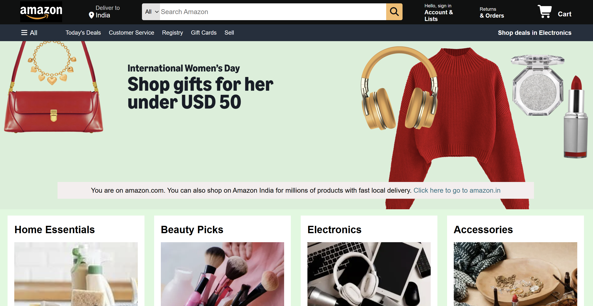

# 🛒 Amazon Homepage Clone

A modern and fully responsive **Amazon Homepage Clone** built using **HTML5, CSS3, and JavaScript**. This project recreates the look and feel of Amazon's landing page while focusing on clean design, responsive layouts, and interactive user experience.

<p align="center">
  
</p>

---

## 🚀 Live Demo

🌐 **Live Website:** https://your-username.github.io/amazon_homepage_clone/

💻 **GitHub Repository:** https://github.com/KumariRitu@1/amazon_homepage_clone

---

## ✨ Features

- 🎨 Modern Amazon-inspired User Interface
- 📱 Fully Responsive Design (Desktop, Tablet & Mobile)
- 🔍 Interactive Search Bar
- 🖱️ Smooth Hover Animations
- 📦 Responsive Product Grid
- 📌 Sticky Navigation Bar
- ⬆️ Smooth Back to Top Functionality
- 🎯 Clean and Organized Code Structure
- ⚡ Fast and Lightweight Performance

---

## 🛠️ Tech Stack

| Technology | Usage |
|------------|---------------------------|
| HTML5 | Page Structure |
| CSS3 | Styling & Layout |
| JavaScript | Interactivity |
| Font Awesome | Icons |
| Responsive CSS | Mobile-Friendly Design |

---

## 📂 Project Structure

```
amazon-homepage-clone/

│── index.html
│── script.js

├── css/
│   ├── style.css
│   └── responsive.css

├── images/
│   ├── Amazon-logo.webp
│   ├── hero.jpg
│   ├── box1.jpg
│   ├── beauty-picks.webp
│   ├── electronics.webp
│   ├── accessories.webp
│   ├── bags.webp
│   ├── toys.webp
│   ├── personal-care.webp
│   ├── gaming-accessories.webp
│   └── preview.png

└── README.md
```

---

## 📸 Project Highlights

✔ Responsive Navigation Bar

✔ Hero Banner Section

✔ Product Categories Grid

✔ Modern Footer Design

✔ Optimized for Mobile, Tablet & Desktop

✔ Interactive UI Components

---

## 🎯 Learning Outcomes

This project helped strengthen my understanding of:

- Responsive Web Design
- CSS Flexbox & Layout Techniques
- JavaScript DOM Manipulation
- UI/UX Principles
- Frontend Project Structure
- Git & GitHub Workflow

---


## 🌟 Future Improvements

- Product Search Functionality
- Hero Image Slider
- Dark Mode Toggle
- Category Filtering
- Shopping Cart Counter
- Wishlist Feature
- Enhanced Animations

---

## 👩‍💻 Developer

**Kumari Ritu**

Frontend Developer & Python Programmer

- 🔗 GitHub: https://github.com/KumariRitu21
- 💼 LinkedIn: [https://www.linkedin.com/in/kumari-ritu-8389983b2 ](https://www.linkedin.com/in/kumari-ritu-8389983b2?utm_source=share&utm_campaign=share_via&utm_content=profile&utm_medium=android_app)

---

## ⭐ Support

If you found this project helpful or inspiring, consider giving it a ⭐ on GitHub.

It motivates me to build and share more frontend projects.

---

<p align="center">
  Made with ❤️ by <b>Kumari Ritu</b>
</p>
